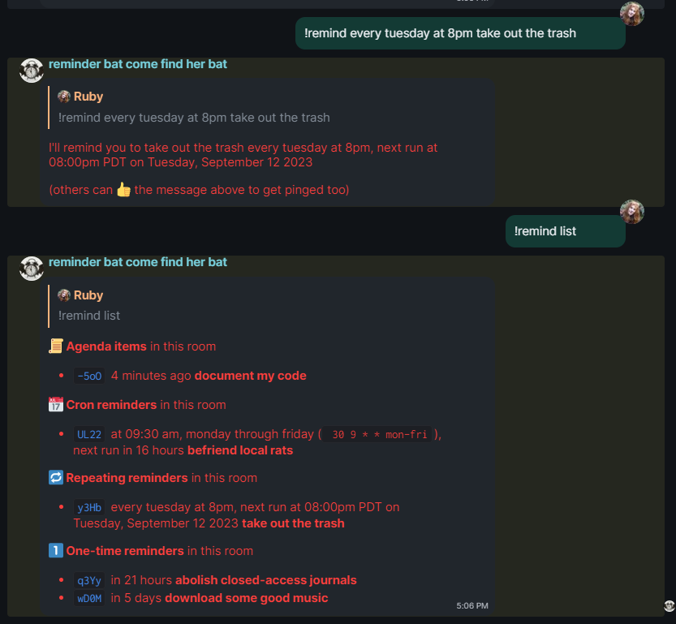

# ⏰ reminder-agenda bot
A [maubot](https://github.com/maubot/maubot) to remind you about things.

Basically [matrix-reminder-bot](https://github.com/anoadragon453/matrix-reminder-bot/tree/master) and [maubot/reminder](https://github.com/maubot/reminder) smushed together. This project includes code taken from both repositories, credit goes to them!



## Features

* Set once-off reminders and recurring reminders
* To-do lists
* Parse natural language (e.g. `every friday at 2pm`) and crontab syntax
* Remind just yourself or the whole room
* Subscribe to other people's reminders
* Lots of [locales](https://dateparser.readthedocs.io/en/latest/supported_locales.html)
* Per-user rate limits
* Maubot!

## Setup
This bot requires python libraries that aren't included in the official maubot docker image.

* [apscheduler](https://github.com/agronholm/apscheduler)
* [dateparser](https://github.com/scrapinghub/dateparser)
* [cron_descriptor](https://github.com/Salamek/cron-descriptor) (optional, shows cron reminders with natural language)

Be sure to add them to the optional-requirements.txt file in [maubot](https://github.com/maubot/maubot) and build a new docker image with
`docker build --tag maubot-for-reminders . -f Dockerfile`

This is pretty easy to use with the [ansible deployment](https://github.com/spantaleev/matrix-docker-ansible-deploy), just add this line to your vars.yml: `matrix_bot_maubot_docker_image: maubot-for-reminders`

## Usage
### Creating optionally recurring reminders:
`!remind <message containing date>` Adds a reminder by extracting the date from the text
* `!remind abolish closed-access journals at 3pm tomorrow`
* `!remind 8 hours buy more pumpkins`
* `!remind 2023-11-30 15:00 befriend rats`

`!remind <date>; <message>` Bypasses text parsing by explicitly specifying the date
* `!remind 2 days 4 hours; do something`

`!remind [room] [every] ...`
* `[room]` pings the whole room
* `[every]` create recurring reminders `!remind every friday 3pm take out the trash`

`!remind [room] <cron> <message>` Schedules a reminder using a crontab syntax
* `!remind cron 30 9 * * mon-fri do something` sets reminders for 9:30am, Monday through Friday.
* `!remind cron` lists more examples

You can also reply to any message with `!remind ...` to get reminded about that message.\\
To get pinged by someone else's reminder, react to their message with 👍.

### Creating agenda items
`!agenda [room] <message>` creates an agenda item. Agenda items are like reminders but don't have a time, for things like to-do lists.

### Listing active reminders
`!remind list [all] [my] [subscribed]` lists all reminders in a room 
* `all` lists all reminders from every room
* `my` lists only reminders you created
* `subscribed` lists only reminders you are subscribed to

### Deleting reminders
Cancel reminders by removing the message creating it, unsubscribe by removing your upvote.\\
Cancel recurring reminders by replying to the ping with `!remind cancel|delete` 
* `!remind cancel|delete <ID>` deletes a reminder matching the 4 letter ID shown by `list`
* `!remind cancel|delete <message>` deletes a reminder *beginning with* <message>
    * e.g. `!remind delete buy more` would delete the reminder `buy more pumpkins`

### Rescheduling
Reminders can be rescheduled after they have fired by replying with `!remind <new date>`

### Settings
Dates are parsed using your [timezone](https://en.wikipedia.org/wiki/List_of_tz_database_time_zone) and [locale](https://dateparser.readthedocs.io/en/latest/supported_locales.html).
* `!remind tz|timezone [new-timezone]` view or set your timezone
* `!remind locale [new-locale]` view or set your locale

## Cron Syntax
```
*	any value
,	value list separator
-	range of values
/	step 

┌─────── minute (0 - 59)
│ ┌─────── hour (0 - 23)
│ │ ┌─────── day of the month (1 - 31)
│ │ │ ┌─────── month (1 - 12)
│ │ │ │ ┌─────── weekday (0 - 6) (Sunday to Saturday)                             
│ │ │ │ │
* * * * * <message>
```

```
30 9 * * *              Every day at 9:30am
0/30 9-17 * * mon-fri   Every 30 minutes from 9am to 5pm, Monday through Friday
0 14 1,16 * *           2:00pm on the 1st and 16th day of the month
0 0 1-7 * mon           First Monday of the month at midnight